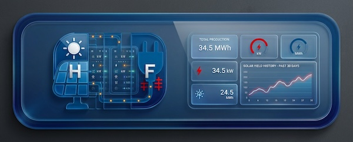
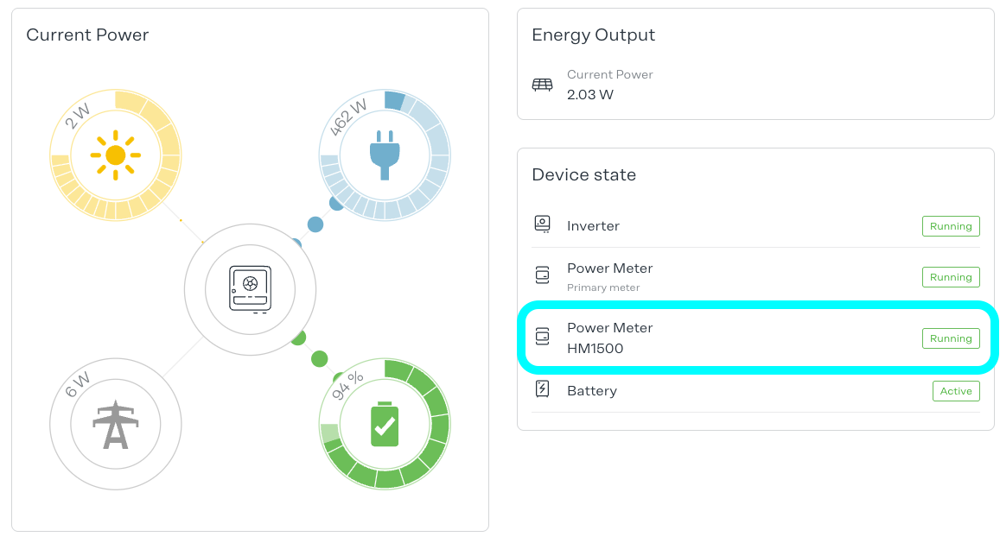
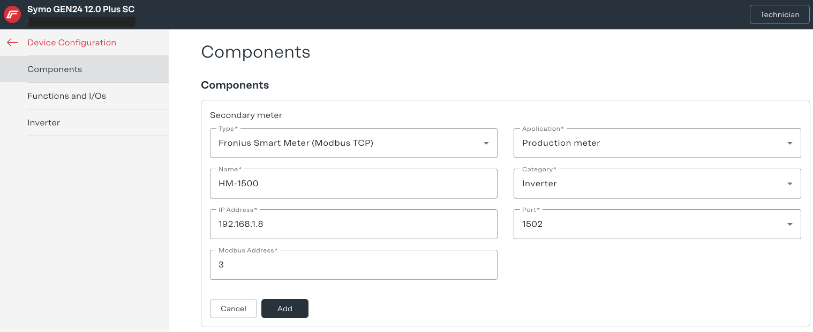

# OpenDTU Fronius Virtual Meter

A **Home Assistant App** that makes a Fronius GEN24 (or GEN24 Plus) aware
of production from one or more OpenDTU-managed inverters (e.g. Hoymiles
HM/HMS microinverters) that OpenDTU already tracks, but the GEN24
otherwise can't see. It emulates a Fronius-compatible SunSpec Modbus TCP
smart meter, fed live and combined from every configured inverter,
each attributed to its own wired phase.

Once registered as an additional meter (role: **Generator**) in the
GEN24's Device Configuration -> Components settings, the combined
production shows up correctly in the local power-flow display, Solar.web
totals, and self-consumption statistics, without needing to physically
rewire anything or install a second real meter.

## Why a combined meter, not one per inverter?

This project's sibling,
[hoymiles-fronius-meter](https://github.com/ChrisDietrich/hoymiles-fronius-meter),
tried "one virtual meter per inverter" first. It works for exactly one
inverter -- but a real Fronius GEN24's "add meter" dialog **rejects a
second Modbus TCP meter entry that shares an IP address with an existing
one, regardless of port**. Since a Home Assistant host normally has one
IP address, that makes "one meter per inverter" a dead end unless you're
willing to set up a second IP alias or NIC on that host.

This App sidesteps the problem entirely: every configured inverter feeds
into **one** combined virtual meter, so GEN24 only ever sees one Modbus
TCP meter to register. Each inverter still gets attributed to its own
wired phase (L1/L2/L3) within that one meter's 3-phase register set,
rather than collapsing everything onto a single phase regardless of which
leg it's actually wired to -- see [DOCS.md](DOCS.md) for how that works.

## Requirements

- A **Home Assistant** instance that supports Apps (Home Assistant OS
  or Supervised -- Apps are not available on Home Assistant Container
  or Core installs)
- A Fronius GEN24 (or GEN24 Plus) with a primary meter already configured
  (Energy Profiling only offers additional-meter slots once one exists)
- One or more inverters managed by
  [OpenDTU](https://github.com/tbnobody/OpenDTU), publishing to MQTT
- An MQTT broker reachable from both OpenDTU and this Home Assistant
  instance

## Installation

Use the one-click badge:

Or manually:
1. In Home Assistant, go to **Settings -> Apps -> App Store**
2. Click the **:** menu (top right) -> **Repositories**
3. Add this repository's URL:
   `https://github.com/ChrisDietrich/opendtu-fronius-meter`
4. Find **"OpenDTU Fronius Virtual Meter"** in the store and click
   **Install**

## Configuration

1. Open the App's **Configuration** tab
2. Fill in your MQTT broker's host/port/credentials
3. Under **Inverters**, add one entry per inverter: fill in **OpenDTU
   base topic** (check OpenDTU's Settings -> MQTT page) and **Wired
   phase** -- that's usually all you need per entry; the power/energy/
   voltage/current/frequency/power factor/reactive power topics are
   derived automatically
4. Start the App, confirm its log shows `Connected to MQTT broker` and
   `Subscribed to ...` lines
5. In the GEN24 UI, add this App's IP:port as an additional meter, role
   **Generator**
   * Log in as technician
   * Device Configuration -> Components
   * Click Add component
   * See screenshot below for an example, use the IP address of the HA instance

See [DOCS.md](DOCS.md) (the App's Documentation tab) for full
configuration details, phase wiring, and troubleshooting.

## Authors & contributors

Initial version by [Chris Dietrich](https://chrisdietri.ch).

## Similar projects and resources

- [hoymiles-fronius-meter](https://github.com/ChrisDietrich/hoymiles-fronius-meter),
  this project's sibling -- one virtual meter per inverter, which works
  for a single inverter but hits the IP-registration limit above with
  more than one
- [OpenDTU2ModbusTCP](https://github.com/Indiana8000/SmartHomeScripts/tree/main/adapter/OpenDTU2ModbusTCP), a script that implements a similar idea
- [fronius_smart_meter_modbus_tcp_emulator](https://github.com/tichachm/fronius_smart_meter_modbus_tcp_emulator), a script that implements a similar idea

## License

This project is licensed under the MIT License. See [LICENSE.md](LICENSE.md) for details.
